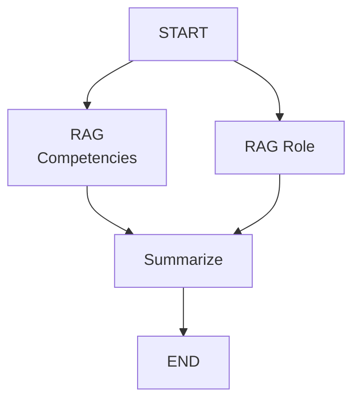

# Question 1

### Tech Stack

- **Python**
  - Streamlit
  - Langgraph
- **PostgreSQL**
  - pgvector
- **Ollama**
- **Docker**

### Agent Flow



### Setup Guide

1. clone the repository and access to folder

   ```bash
   git clone https://github.com/gotired/conicle-test.git && cd conicle-test/q1/
   ```

2. define `.env` **example:** [`.env.example`](.env.example)

   - **PGVECTOR_URI** : postgresql connection string
   - **OLLAMA_BASE_URL** : ollama base url **default :** http://ollama:11434
   - **REASON_MODEL_FLAG** : reasoning model flag **default :** false
   - **CHAT_MODEL** : chat model name **default :** gemma3:1b
   - **EMBED_MODEL** : embedded model name **default :** nomic-embed-text
   - **POSTGRES_USER** : postgres default username
   - **POSTGRES_PASSWORD** : postgres default password
   - **POSTGRES_DB** : postgres default database name

3. run all service with docker commmand

   ### Mac (arm)

   recommend to use [ollama](https://ollama.com/download) along docker desktop for best performance

   set `OLLAMA_BASE_URL` in `.env`

   ```.env
   OLLAMA_BASE_URL=http://host.docker.internal:11434
   ```

   then run command

   ```bash
   docker compose -f docker-compose-mac.yaml up --build
   ```

   ### Linux and Mac (intel)

   ```bash
   docker compose up --build
   ```

   ### Linux with gpu

   ```bash
   docker compose -f docker-compose-gpu.yaml up --build
   ```

4. access `streamlit` expose url at [`link`](http://localhost:8501)
