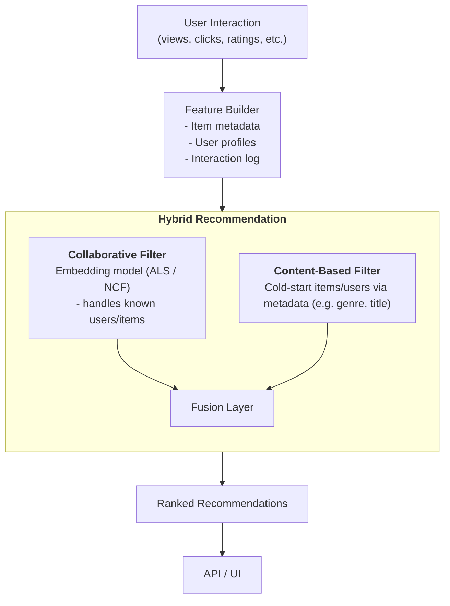

# **Question 2** : Design a Recommendation System and Address the Cold-Start Problem

## **Implicit** VS **Explicit** feedback.

| Aspect         | Explicit Feedback                            | Implicit Feedback                              |
| -------------- | -------------------------------------------- | ---------------------------------------------- |
| **Definition** | Direct feedback like ratings, likes/dislikes | Indirect signals like clicks, views, purchases |
| **Examples**   | 5-star ratings, reviews                      | Time spent, click-through rate, add-to-cart    |
| **Pros**       | Clear user preference signal                 | Abundant, passively collected                  |
| **Cons**       | Sparse, users may not leave feedback         | Noisy, uncertain intent                        |

## System Workflow & Architecture

## Model Selection

| Model                                                         | Feedback Type | Loss Function                         | Best For                             |
| ------------------------------------------------------------- | ------------- | ------------------------------------- | ------------------------------------ |
| **SVD (Singular value decomposition) / Matrix Factorization** | Explicit      | MSE (Mean squared error) / Regression | Predicting ratings (e.g., 4.5 stars) |
| **ALS (Alternating Least Squares) (explicit)**                | Explicit      | MSE (Mean squared error)              | Explicit feedback with missing data  |
| **ALS (Alternating Least Squares) (implicit)**                | Implicit      | Confidence-weighted loss              | Large-scale implicit data            |
| **BPR (Bayesian Personalized Ranking)**                       | Implicit      | Ranking (pairwise)                    | Ranking preferred items              |
| **NCF (Neural Collaborative Filtering) (Flexible)**           | Both          | Regression / Ranking                  | Both use-cases, depending on loss    |

## Cold Start Problem Handling

1. New Users

- Solution: Use content-based or demographic-based initialization
  - Ask onboarding questions (preferences, role, goals)
  - Infer interests from session behavior
  - Recommend popular or trending items based on metadata similarity

2. New Items

- Solution: Content-based similarity
  - Use NLP models (e.g., BERT embeddings of titles/descriptions)
  - Recommend to users whose profiles match the item's metadata
