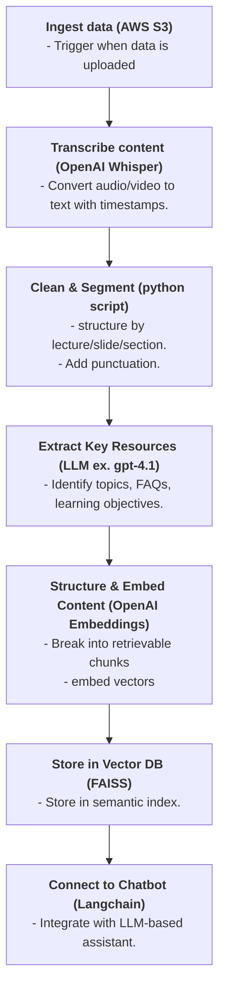

# Question 3 : System Design: Course Transcription & Chatbot Assistant Integration

## Pipeline



## Example Airflow DAG Flow

```py
with DAG("course_pipeline", ...) as dag:
    ingest = PythonOperator(task_id="ingest_media", ...)
    transcribe = PythonOperator(task_id="transcribe", ...)
    clean = PythonOperator(task_id="clean_transcript", ...)
    extract = PythonOperator(task_id="extract_resources", ...)
    embed = PythonOperator(task_id="embed_chunks", ...)
    index = PythonOperator(task_id="index_vector_db", ...)
    notify = PythonOperator(task_id="notify_chatbot_ready", ...)

    ingest >> transcribe >> clean >> extract >> embed >> index >> notify
```

## (Bonus)

> Idea for scaling for multiple courses, handle failures/retries, or support modular plugin-like components.

| Aspect                           | Strategy                                                                                                                                                          |
| -------------------------------- | ----------------------------------------------------------------------------------------------------------------------------------------------------------------- |
| **Scaling for multiple courses** | Use Airflow’s dynamic DAGs or task parameterization. Run each course as a separate DAG instance.                                                                  |
| **Failure handling**             | Airflow’s built-in retries, alerts, and task-level retry policies. Fail specific tasks without blocking whole DAG. Store intermediate results (S3, DB) to resume. |
| **Plugin-like modularity**       | Each task is isolated and can be swapped: e.g., switch Whisper with AWS Transcribe, FAISS with pgvector. Use Airflow task groups for clean abstraction.           |
